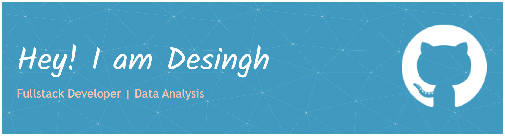

I am a Software Developer and Data Science Enthusiast with a strong interest in Python, Java, Flask, PHP, SQL, Web Development, Machine Learning, and Data Visualization.

- ✨ Passionate about continuous learning and self-improvement
- 🌱 Exploring advanced concepts in Machine 
- Learning and Full-Stack Development
- 📊 Experienced in building dashboards and data-driven applications
- 💻 Building real-world web and software applications
- 📈 Interested in transforming data into meaningful insights
- ❤ Enthusiastic about problem-solving and clean, efficient code

---

### I code in
      
   

---

### IDE and Tools I Use
    

---

### Social Presence
 
  
   
